---
hide:
  - toc
---

{ .hero-logo }

International workshop · Japan · 2026

<h1 class="hero-title">
  
    Structure and
  
  
    Closure in
  
  
    Nonequilibrium
  
  
    Flows
  
</h1>

  SCNF 2026 is an invitation-only workshop devoted to the structural foundations of nonequilibrium flow modelling beyond the classical Navier–Stokes–Fourier regime. Bringing together perspectives from <strong>Rational Extended Thermodynamics (RET)</strong>, <strong>kinetic theory and moment hierarchies</strong>, <strong>GENERIC</strong>, and neighboring continuum or statistical approaches, the workshop is designed to compare structural principles across frameworks, sharpen open questions in <strong>boundary and interface conditions</strong> as well as <strong>computational realization</strong>, and identify benchmark problems and collaborations for the next stage of the field.

Dates
<strong>8–11 Dec 2026</strong>

Venue
<strong>Tokyo, Japan</strong>
<!-- <small>Kyoto remains an alternative under consideration</small>-->

Participation
<strong>Invitation only</strong>

[About](about.md){ .md-button .md-button--primary }
[Program](program.md){ .md-button }
[Venue](venue.md){ .md-button }

<!--
## Scientific themes

The workshop is organized around four overlapping themes that span the current scientific planning set of invited speakers.

-   :material-book-open-variant:{ .lg .middle } **Structure, entropy, and admissible closure**
    Thermodynamic consistency, entropy production, hyperbolicity, stability, realizability, and the choice of state variables across RET, GENERIC, and related nonequilibrium theories.

-   :material-chart-timeline-variant:{ .lg .middle } **Kinetic, moment, and multiscale bridges**
    Kinetic theory, moment hierarchies, hydrodynamic limits, dense-gas effects, and molecular or statistical routes to macroscopic modelling beyond the classical NSF setting.

-   :material-waveform:{ .lg .middle } **Shocks, interfaces, fluctuations, and complex media**
    Shock structure, rarefied transport, multiphase systems, fluctuating hydrodynamics, interface problems, and other regimes where structure and closure are tightly intertwined.

-   :material-calculator-variant-outline:{ .lg .middle } **Boundary conditions, computation, and benchmark problems**
    Boundary and interface conditions, structure-preserving computation, hyperbolic continuum models, and benchmark problems connecting theory, simulation, and experiment.

-->

## Organizers and advisors

SCNF 2026 is conceived as a compact forum for careful comparison of ideas, technical bottlenecks, and shared scientific priorities.

- **Organizing Committee** 
  Takashi Arima 
  Elvira Barbera 
  Francesca Brini 
  Shigeru Taniguchi 
  [:octicons-arrow-right-24: Full details](organizers.md)

- **Advisors**  
  Tommaso Ruggeri 
  Masaru Sugiyama 
  [:octicons-arrow-right-24: Full details](organizers.md)

Participation is by invitation only. The current scientific planning set of invited speakers is listed on the <a href="participants/">Participants</a> page.

